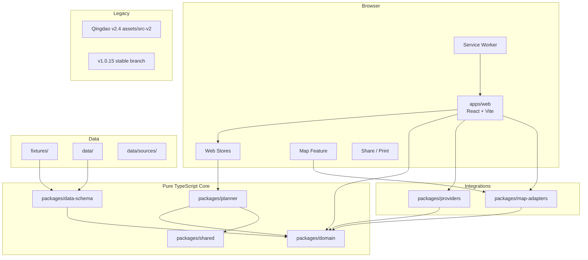

# Container Design

## 1. 逻辑容器



## 2. 容器职责

### 2.1 `apps/web`

职责：

- React 应用外壳和路由；
- TripRequest 表单；
- 行程、冲突、假设、来源和新鲜度展示；
- 拖拽与锁定交互；
- i18n；
- 调用 Planner；
- 调用 Provider registry 获取可选增强；
- 调用 MapAdapter 渲染；
- 分享 JSON、打印和浏览器 PDF；
- Provider 失败提示。

禁止：

- 直接 fetch 第三方 API；
- 在组件内编写规划规则；
- 在组件内进行坐标系转换；
- 使用 `window.*` 共享业务状态；
- 将 Provider 原始响应写入 store。

### 2.2 `packages/domain`

职责：

- Place、PlanningUnit、POI、TripRequest、TripPlan 等类型；
- 领域枚举和值对象；
- 时间、货币、坐标、来源和动态观察值语义；
- 不变量所需的纯校验函数。

依赖限制：

- 不依赖 React、浏览器、DOM、网络、Leaflet 或任何 Provider SDK。
- 可被 Node、浏览器、测试和未来服务端共同使用。

### 2.3 `packages/data-schema`

职责：

- Zod runtime schema；
- JSON Schema 导出；
- fixture/data CLI 校验；
- Schema version 和向前迁移；
- legacy Qingdao importer 的输入/输出验证。

依赖：可以依赖 `domain` 的类型定义，但不依赖 UI。

### 2.4 `packages/planner`

职责：

- 输入规范化；
- 目的地天数分配；
- POI 聚类和日程排布；
- TravelLeg 插入；
- 用餐、休息、入住和退房规则；
- 冲突检测；
- 锁定项重规划；
- 规划解释、假设和 warning；
- 最终不变量验证；
- seed 驱动的稳定 tie-break。

禁止：

- 网络请求；
- 地图渲染；
- DOM/React；
- 读取当前时间而不通过输入注入；
- 使用 LLM 生成活动事实。

### 2.5 `packages/providers`

职责：

- Provider 接口和 capability；
- timeout、AbortSignal、错误分类；
- cache/stale 规则；
- 原始响应到领域 DTO 的 mapper；
- fixture/mock/null Provider；
- 无秘密 Provider 的浏览器实现。

禁止：

- 修改 UI 或 store；
- 返回未经规范化的 SDK/HTTP 原始对象；
- 静默伪造成功数据；
- 无限重试；
- 在前端保存秘密。

### 2.6 `packages/map-adapters`

职责：

- `MapAdapter` contract；
- Leaflet 实现；
- 内部 WGS84 到地图坐标的边界转换；
- marker、polyline、fitBounds、selection 和 lifecycle；
- fixture adapter 用于测试。

禁止：

- 调用 Planner；
- 修改 TripPlan；
- 直接访问 Provider；
- 将 GCJ-02 写回领域数据。

### 2.7 `packages/shared`

职责：

- 无业务含义的通用纯工具；
- result、assertNever、stable sort、seeded random、日期辅助；
- 不应成为任意代码堆放区。

### 2.8 `data/`

正式、审核通过的数据：

- destinations；
- POI；
- planning units；
- SourceRef；
- 数据 manifest 和版本。

所有内容必须通过 Schema、来源和许可检查。

### 2.9 `fixtures/`

测试与演示数据：

- 至少一个中国大陆目的地；
- 至少一个海外目的地；
- TripRequest；
- Provider 成功/失败/stale 响应；
- legacy Qingdao 导入样例。

UI 必须明确 fixture 状态，不能展示为实时。

### 2.10 Legacy 容器

现有 `src-v2`、`assets`、`versions` 和旧工作流作为独立 Legacy 容器保留。它可以被 legacy baseline CI 验证，但不参与新 workspace 的运行时依赖图。

## 3. Workspace 依赖方向

允许：

```text
shared <- domain <- data-schema
shared <- domain <- planner
shared <- domain <- providers
shared <- domain <- map-adapters
(domain + planner + providers + map-adapters) <- apps/web
```

禁止：

```text
planner -> providers
planner -> map-adapters
planner -> React/DOM
providers -> apps/web
map-adapters -> planner
packages/* -> src-v2 legacy globals
```

## 4. 物理部署容器

第一阶段只有一个部署产物：GitHub Pages 静态站点。

- `apps/web/dist/`：新版 Global Web。
- `legacy/qingdao-v2.4/`：复制已验证的 legacy 发布资产，不重新迁移源码。
- 无后端容器。
- 需要秘密凭据的 capability 返回 unavailable。

未来若确实需要安全代理，必须通过 ADR 增加独立 Node/Serverless/Edge 容器，并说明成本、数据流和回滚方式。
