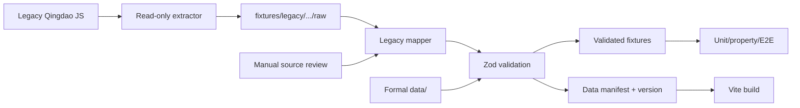
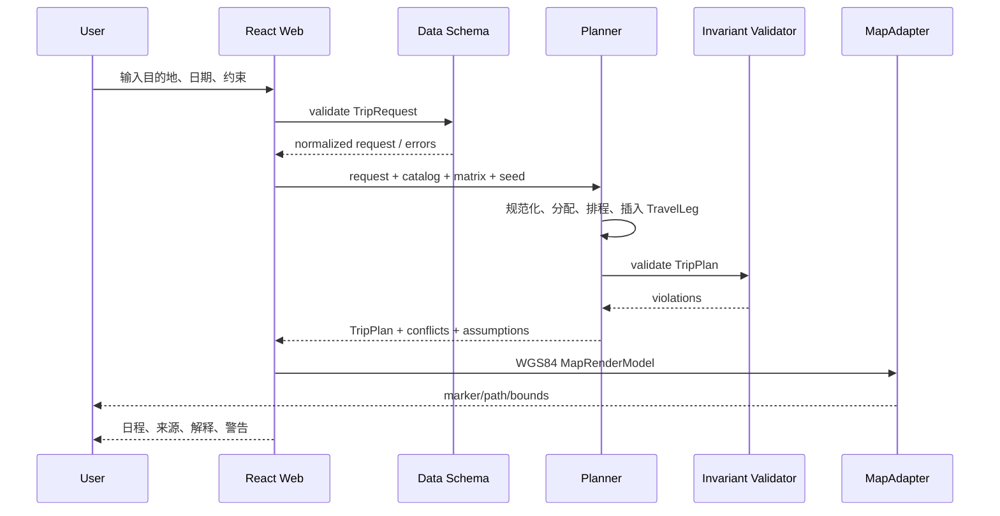
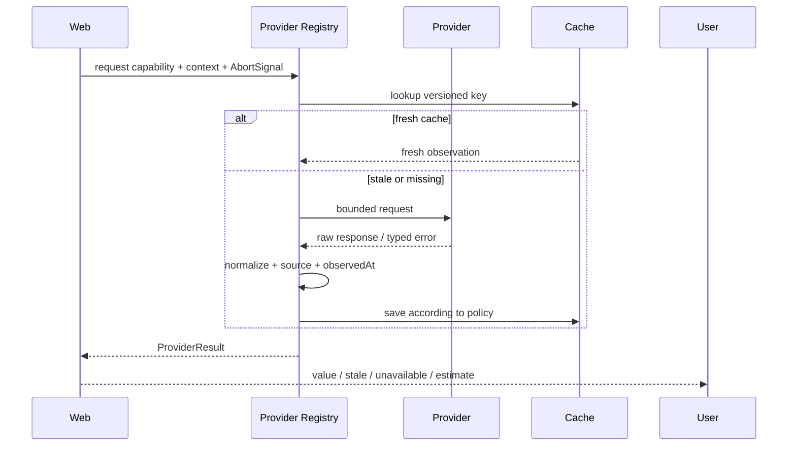
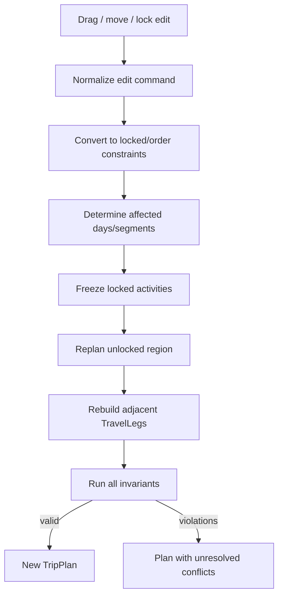

# Data Flow

## 1. 数据分类

| 类型 | 示例 | 更新方式 | 是否可影响 Planner |
|---|---|---|---|
| Canonical domain data | Place、POI、PlanningUnit | 审核后随代码/数据版本发布 | 是 |
| User input | TripRequest、锁定项、排序 | 浏览器交互和分享 JSON | 是 |
| Deterministic derived data | TripPlan、TravelLeg、冲突 | Planner 计算 | 是，作为输出 |
| Provider observation | 天气、路线、汇率、开放时间 | 运行时请求、缓存 | 默认仅增强；重新规划需显式触发 |
| UI state | tab、selection、drawer | 临时 store | 否 |
| Legacy fixture | 青岛 v2.4 数据 | 只读 importer | 仅通过新 Schema 后可用 |

## 2. 构建期数据流



规则：

1. Legacy extractor 不修改输入文件。
2. Mapper 不访问网络。
3. 正式 data 和 fixture 分开。
4. Schema 校验失败时 build 失败。
5. Build 只写 `dist/` 和明确 generated schema 目录。
6. Build 后 Git 工作区必须干净。

## 3. 基础规划数据流



Planner 的输入必须完整、显式：

- 数据版本；
- Schema 版本；
- Planner 版本；
- seed；
- clock；
- travel time matrix 的来源和估算类型。

## 4. Provider 增强数据流



ProviderResult 不直接覆盖 TripPlan。处理方式：

- 天气：作为风险和提示层；
- 汇率：作为预算展示观察值；
- 开放时间：若与计划冲突，创建 `replanSuggestion`；
- 路线：可生成新的 TravelTimeMatrix 版本，再由用户触发 Planner；
- 价格：只作为 DynamicObservation，不进入确定性核心预算承诺。

## 5. 拖拽和锁定后的重规划



重规划规则：

1. 不静默删除锁定活动。
2. 被拖拽活动的新顺序是显式 constraint。
3. 锁定活动两侧 TravelLeg 必须重算或标记 unavailable。
4. 无法满足时间窗时保留活动并生成冲突。
5. 重新规划结果保留 previousPlanId 和 edit history 摘要。

## 6. 分享 JSON 数据流

分享文件包括：

```ts
interface TripShareEnvelope {
  schemaVersion: number;
  appVersion: string;
  createdAt: string;
  request: TripRequest;
  userEdits: TripEdit[];
  planner: {
    version: string;
    seed: number;
    dataVersion: string;
  };
  plan?: TripPlan;
}
```

导入步骤：

1. 解析 JSON，不执行任何代码。
2. 校验 envelope 大小和 schemaVersion。
3. 运行逐版本纯迁移。
4. 验证 TripRequest 和可选 TripPlan。
5. 对 plan 再执行不变量验证。
6. 如果数据版本不同，显示“按当前数据重新规划”选项，不静默改写。

## 7. 本地存储数据流

```text
React store
  -> StorageAdapter.serialize(envelope)
  -> schema validation
  -> LocalStorage / IndexedDB
  -> read
  -> migrate
  -> validate
  -> store
```

失败处理：

- QuotaExceeded：保留内存状态并提示无法持久化。
- 损坏 JSON：隔离原始值，使用默认状态。
- 未来 Schema：只读提示，不写回。
- migration 失败：不删除旧值。

## 8. 地图数据流

```text
TripPlan / POI catalog
  -> buildMapRenderModel (WGS84)
  -> MapAdapter
  -> provider-specific coordinate conversion
  -> Leaflet / future AMap
```

地图点击只产生 UI selection 或编辑 command。地图不得直接修改 Planner 内部对象。

## 9. 打印与 PDF

第一阶段不引入服务端 PDF：

- Web 使用 print-specific CSS；
- 打印模型来自 TripPlan 和 SourceRef；
- 地图打印可降级为地点列表；
- 浏览器“打印为 PDF”是正式支持路径；
- 导出内容注明数据版本、生成时间、估算和 stale 信息。

## 10. 数据泄露防护

不得进入日志、分享 JSON或错误报告：

- Provider secret；
- 完整鉴权 URL；
- 浏览器精确定位，除非用户明确选择分享；
- 第三方完整评论文本；
- 未经用户同意的个人身份信息。
