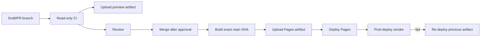

# Deployment Architecture

## 1. 第一阶段部署目标

第一阶段使用 GitHub Pages 部署一个纯静态前端，不引入没有实际用途的后端。

部署内容：

```text
/Global-travel-plans/
  index.html                  Global Web
  assets/*                    Vite hashed assets
  data/*                      validated public fixtures/data
  legacy/qingdao-v2.4/*       preserved Qingdao release assets
  legacy/qingdao-v1.0.15/*    stable fallback snapshot/entry
  manifest/*                  build/data/schema metadata
```

## 2. 构建产物

Vite 配置必须使用仓库子路径：

```ts
base: '/Global-travel-plans/'
```

但不能在组件中手写该路径。应用通过 `import.meta.env.BASE_URL`、URL helper 和 router basename 处理资源。

构建输出只允许写入：

- `apps/web/dist/`；
- 明确的 schema/generated 目录（如运行独立 generation 命令）。

普通 `npm run build` 后执行：

```bash
git diff --exit-code
```

必须通过。

## 3. CI Pipeline

PR 门禁顺序：

```text
npm ci
format check
lint
typecheck
unit tests
planner invariant/property tests
schema validation
provider contract tests
build
bundle budget
Playwright E2E
visual regression
base-path smoke
secret scan
```

Legacy 基线验证独立运行，不让旧 build 的工作区修改污染新 workspace CI。

## 4. Pages Deployment Workflow

生产部署仅允许：

- `main`；
- 全部门禁通过；
- 上传 immutable artifact；
- 使用 GitHub 官方 Pages actions；
- environment protection（如仓库支持）。

验证工作流不得 commit/push 生成结果。

建议流程：



本任务不自动合并 PR。

## 5. Legacy 保留方式

在切换 Global Web 为主入口前，青岛 v2.4 继续保持现有线上入口。

切换时：

1. 从 `legacy-qingdao-v2.4-baseline` 对应的已验证发布资产复制到 `legacy/qingdao-v2.4/`；
2. 不重新运行会修改源码的 migration build 来生成历史快照；
3. v1.0.15 从稳定分支保留独立入口；
4. Global Web 显示清晰的“青岛旧版”入口；
5. 新版故障时可将 Pages artifact 回滚到切换前版本。

## 6. Service Worker

第一阶段可以先发布无 Service Worker 的最小闭环；只有以下测试齐全后才启用新版 SW：

- install/activate/update；
- navigation offline fallback；
- hashed assets；
- data manifest 更新；
- 旧缓存升级；
- 上一可用版本回滚；
- base path scope；
- 不影响 legacy 子目录。

策略：

| 请求 | 策略 |
|---|---|
| navigation | network-first，失败时 Global app shell |
| hashed JS/CSS | cache-first |
| data manifest | network-first 或 stale-while-revalidate |
| fixture JSON | cache-first，按 dataVersion |
| Provider API | 默认不由 SW 缓存 |
| legacy assets | 独立 namespace，不由 Global SW 删除 |

禁止把任意失败请求统一回退到 HTML。

## 7. 配置和秘密

GitHub Pages 中：

- 所有前端环境变量均可被用户查看；
- 不配置 AMap Web Service secret、安全签名或商业 API secret；
- `.env.example` 只描述变量名；
- 需要秘密的 Provider capability 为 unavailable；
- UI 明确说明功能禁用原因。

未来引入安全网关必须创建 ADR，至少说明：

- 为什么 Static-first 不够；
- 鉴权和速率限制；
- 日志与隐私；
- 成本上限；
- CORS；
- 部署与回滚；
- 本地和 fixture fallback。

## 8. Base-path Smoke Test

CI 使用接近 Pages 的路径启动构建结果：

```text
http://127.0.0.1:<port>/Global-travel-plans/
```

测试至少覆盖：

- 首页直达；
- 深链接和刷新；
- JS/CSS/fixture 200 且 MIME 正确；
- Leaflet marker 和路线可见（使用本地 fixture）；
- 中英文切换；
- 分享 JSON 导入；
- Provider 全失败；
- legacy 路径；
- 打印样式；
- 浏览器 console 无未捕获错误。

部署后再执行只读 smoke，记录 deployment URL 和 SHA。

## 9. Bundle Budget

第一阶段建议初始预算：

- Global Web initial JS gzip：≤ 180 KB；
- initial CSS gzip：≤ 35 KB；
- 首次路由总 gzip（不含地图瓦片）：≤ 250 KB；
- Leaflet 可独立 chunk；
- fixture 数据按目的地懒加载。

预算需要根据首个可运行实现实测调整，调整必须有 PR 解释，不能简单放宽使 CI 通过。

## 10. 发布元数据

每个 artifact 包含：

```json
{
  "appVersion": "...",
  "commitSha": "...",
  "builtAt": "...",
  "dataVersion": "...",
  "schemaVersion": 1,
  "plannerVersion": "...",
  "basePath": "/Global-travel-plans/"
}
```

页面“关于”区域显示同一元数据。Service Worker cache ID 和 share JSON 引用相同版本源。

## 11. 回滚

- 不 force push，不移动基线标签。
- 保留上一个成功 Pages artifact 和 SHA。
- Post-deploy smoke 失败后停止新增发布，重新部署上一 artifact。
- 数据 Schema 升级必须兼容旧分享文件；不能通过回滚代码破坏用户已保存 JSON。
- Legacy Qingdao 作为最终静态回退保持可访问。
