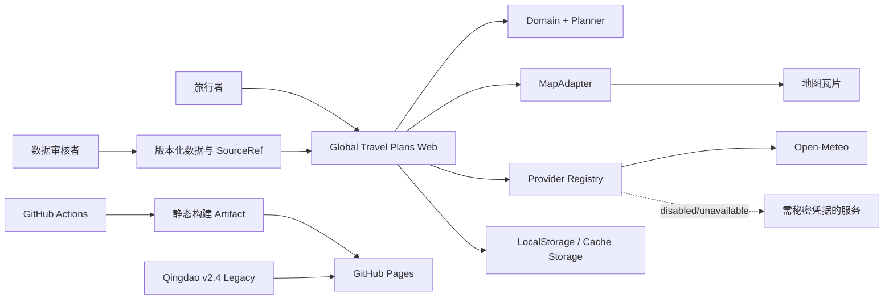

# System Context

## 1. 系统目标

**全球旅行攻略 / Global Travel Plans** 是一个 Static-first、多目的地、可解释的旅行规划系统。它以结构化数据和确定性规划引擎为事实来源，生成可调整、可分享、可打印且在外部服务失败时仍可查看的行程。

系统不承诺第一阶段不存在的实时能力，不将大语言模型作为路线、时间或价格的事实计算器。

## 2. 参与者

| 参与者 | 目标 |
|---|---|
| 旅行者 | 输入目的地、日期、节奏、预算、兴趣、体力和锁定活动，获得可调整行程 |
| 行程维护者/审核者 | 审核 fixture、来源、动态观察值和许可说明 |
| 开发者 | 扩展领域模型、规划规则、Provider 和 UI，同时保持不变量与回滚能力 |
| GitHub Actions | 执行只读 CI、构建 artifact、部署 Pages preview/production |
| 外部 Provider | 提供地理编码、路线、天气、开放时间、汇率等可选增强信息 |

## 3. 外部系统

| 外部系统 | 第一阶段关系 | 信任级别 |
|---|---|---|
| GitHub / GitHub Pages | 代码、CI、静态部署 | 受信基础设施，但 Pages 不能保密 |
| OpenStreetMap/Leaflet 瓦片 | 地图展示；需遵守使用政策 | 外部可用性依赖 |
| Open-Meteo | 可选天气/高程增强 | 无秘密凭据，结果仍需时间戳和降级 |
| 高德地图 | Legacy 使用；Global Core 默认禁用秘密能力 | 旧凭据已公开，不可信任为安全配置 |
| 其他地图/预订/签证服务 | 仅定义能力边界，未授权前不启用 | 未确认 |
| 浏览器 LocalStorage/Cache Storage | 用户本地状态和离线数据 | 不可靠、容量有限、需要 Schema 迁移 |

## 4. 系统边界

## 5. 核心信任规则

1. **Planner 输出是结构化事实源。** UI 和 LLM 不得修改已验证的时间、路线和锁定活动。
2. **Provider 是可选增强。** Provider 全部失败时，静态 fixture 和既有计划仍可使用。
3. **浏览器不是秘密存储。** 进入前端 bundle、环境变量或网络请求的值均视为公开。
4. **动态信息必须携带来源和时间。** 过期值显示 stale，不能显示为实时。
5. **领域坐标统一 WGS84。** GCJ-02 等只存在于地图/Provider 边界。
6. **旧青岛版是独立 Legacy 系统。** 新核心不依赖其全局变量或构建补丁。
7. **构建不得修改手写源码。** 构建后工作区必须干净。

## 6. 主要使用场景

### 6.1 新建跨国行程

旅行者选择中国大陆目的地和海外目的地，输入日期、节奏和约束。Planner 在各目的地之间分配天数并生成每日活动、TravelLeg 和住宿区域。

### 6.2 调整并重新规划

旅行者拖拽活动、锁定关键安排或调整目的地顺序。系统保留锁定项，仅重算受影响区间，并报告无法解决的冲突。

### 6.3 Provider 降级

天气或路线 Provider 不可用时，计划仍显示。对应字段显示 unavailable 或 estimate，且不会生成伪造结果。

### 6.4 分享和恢复

系统将 TripRequest、用户锁定、Planner seed、数据版本和 Schema version 序列化为分享 JSON。接收方在兼容版本中重新验证后打开。

### 6.5 访问旧青岛版

迁移期间用户仍可访问 Qingdao v2.4 和 v1.0.15 稳定回退。新应用故障不会删除旧版资产。

## 7. 不在第一阶段系统边界内

- 全球酒店实时价格、评分和库存聚合；
- 账号、支付和社交；
- 大规模爬虫；
- 自动发布社交媒体；
- 未确认条款和费用的商业 API；
- 将 LLM 作为确定性规划器；
- 全球行政区全量数据库。
